<div align="center">

# 🎓 Learnyx

### Вебплатформа для структурованого онлайн-репетиторства

[](https://python.org)
[](https://djangoproject.com)
[](https://react.dev)
[](https://typescriptlang.org)
[](https://postgresql.org)
[](https://www.django-rest-framework.org)
[](https://docs.docker.com/compose/)


</div>

---

## 📖 About

**Learnyx** — веб-платформа для автоматизації онлайн-навчання між учнями, викладачами та менеджерами.

Система усуває необхідність у розрізнених інструментах — месенджерах, таблицях, зовнішніх календарях — та об'єднує в єдиному місці:

- 📅 Розклад занять та управління слотами
- 📦 Облік та списання пакетів уроків
- 📊 Журнал успішності та оцінювання
- 💰 Бонусну систему **Learning Cashback**

> **Ключові ролі:** `Student` · `Teacher` · `Manager`

## 📸 Інтерфейс платформи
## Hero Pages

| Hero Pages| 
|:---:|
| 
| |

### 👨‍🎓 Кабінет студента

| Дашборд студента | Розклад занять |
|:---:|:---:|
| 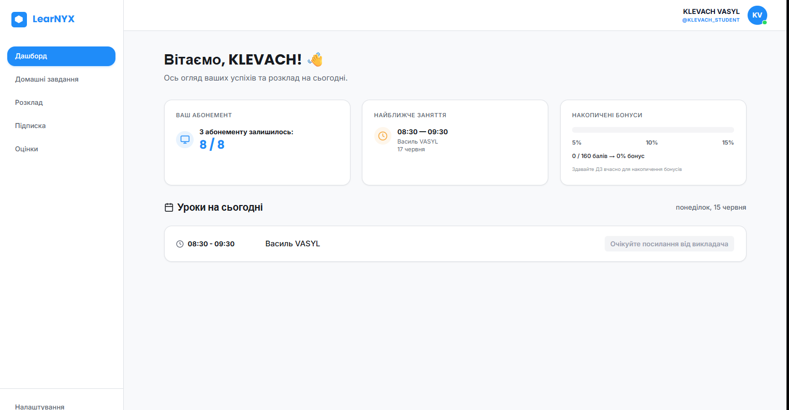 | 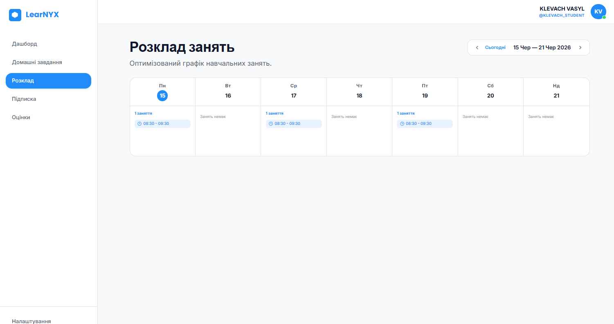 |
| *Уроки на сьогодні, баланс абонементу* | *Тижневий календар із запланованими заняттями* |

| Домашні завдання | Абонемент |
|:---:|:---:|
| 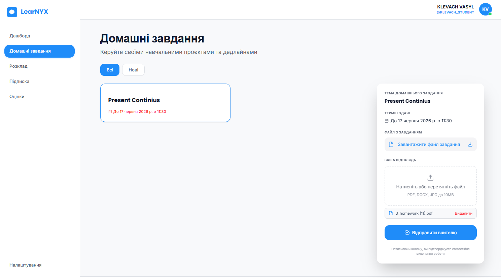 | 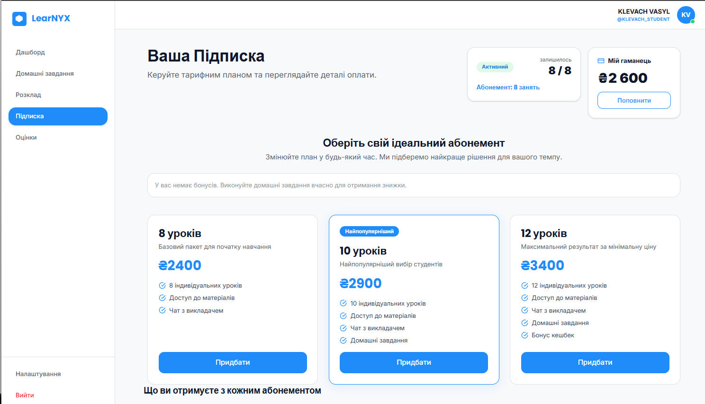 |
| *Завдання від вчителя та завантаження відповіді* | *Три плани з цінами та бонусна знижка* |

---

### 👨‍🏫 Кабінет викладача

| Дашборд викладача | Розклад викладача |
|:---:|:---:|
| 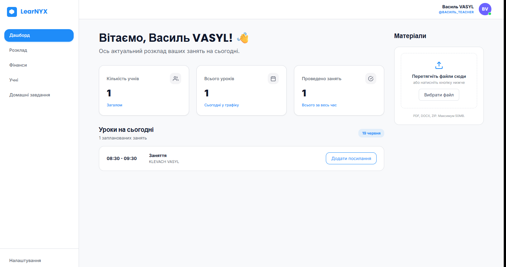 | 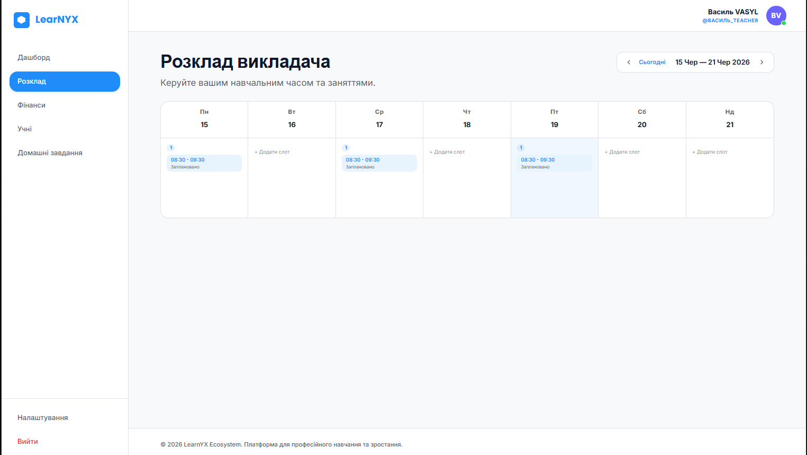 |
| *Уроки на сьогодні, кнопка виставлення оцінки* | *Тижневий вид із вільними та зайнятими слотами* |

| Домашні завдання | Список учнів |
|:---:|:---:|
| 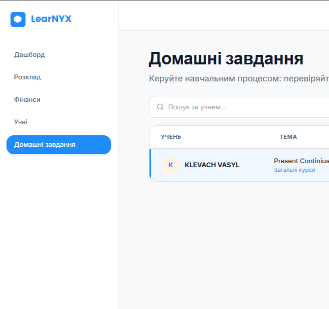 | 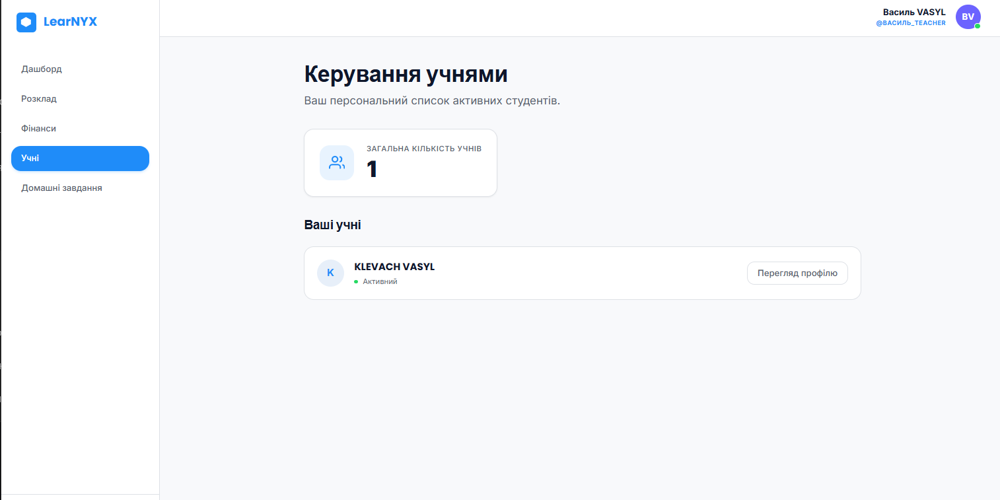 |
| *Роботи учнів та виставлення оцінок* | *Картки учнів з профілем* |

---

### 👔 Кабінет менеджера

| Заявки на реєстрацію | Підбір викладача |
|:---:|:---:|
| 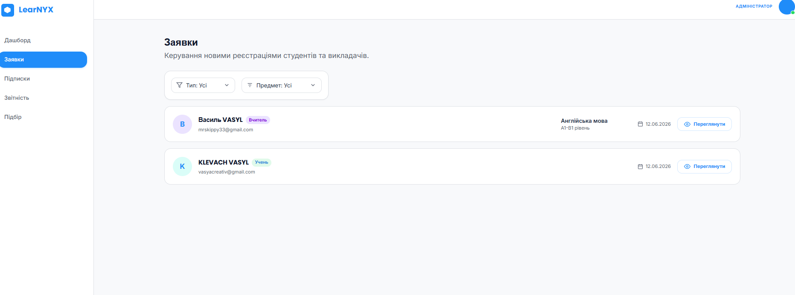 | 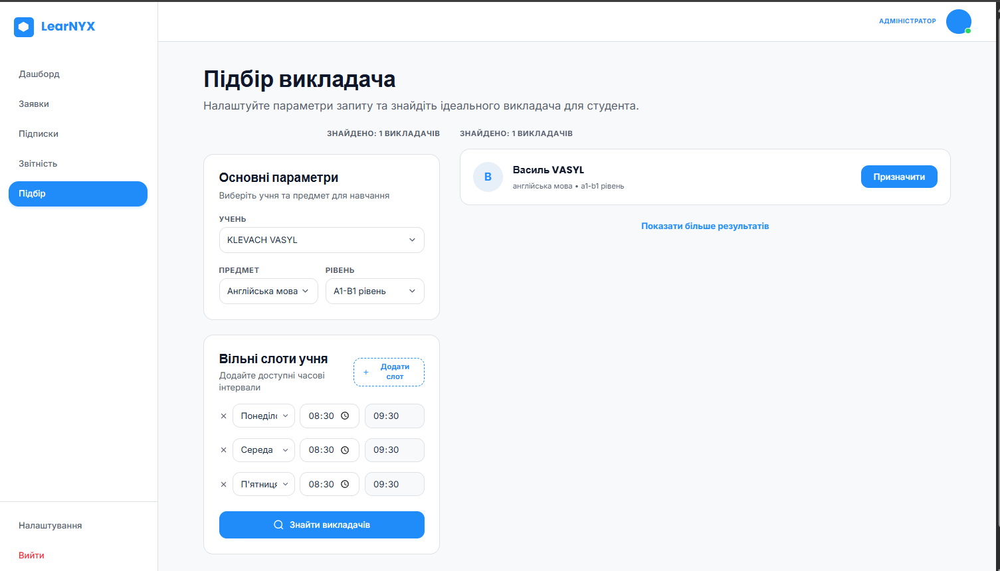 |
| *Підтвердження та відхилення заявок* | *Пошук за предметом, рівнем та часом* |

| Звітність | Скарги |
|:---:|:---:|
| 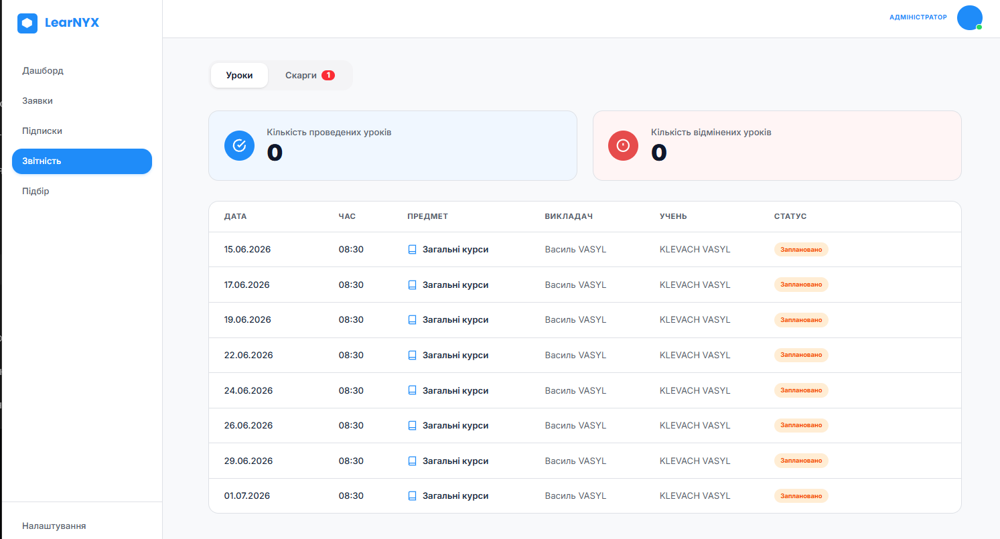 | 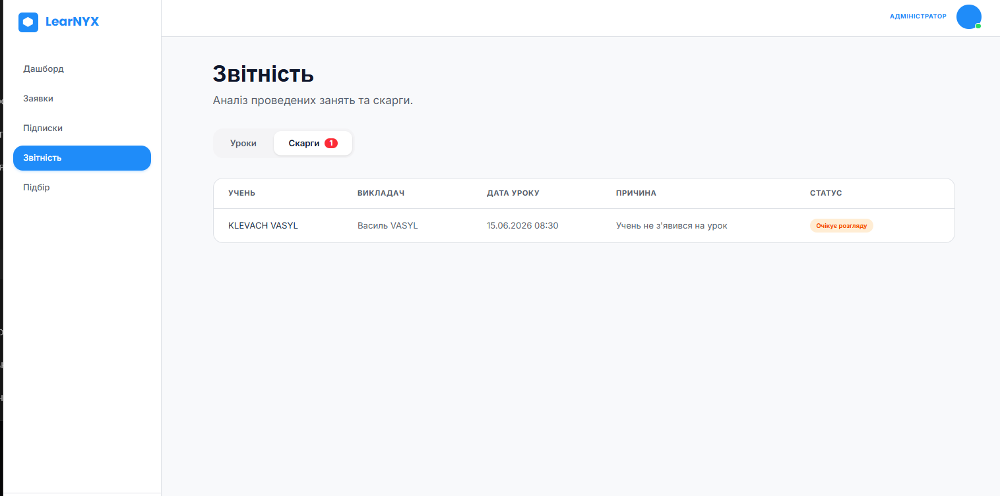 |
| *Таблиця уроків зі статусами* | *Модальне вікно розгляду скарги* |

---

## ✨ Key Features

| Функція | Опис |
|---------|------|
| 🔐 **Рольова модель** | Student, Teacher, Manager з розмежованим функціоналом |
| 🎒 **Кабінет учня** | Розклад, оцінки, домашні завдання, пакети, бонусний баланс |
| 👨‍🏫 **Кабінет викладача** | Слоти розкладу, журнал успішності, управління заняттями |
| 🗂️ **Кабінет менеджера** | Обробка заявок, активація пакетів, моніторинг процесу |
| 💎 **Learning Cashback** | Бонуси **5 / 10 / 15%** на наступний пакет за успішність **85–100%** |
| 📋 **Система пакетів** | Автоматичне списання занять після проведення |

---

## 🛠️ Tech Stack

### Backend
| Технологія | Версія | Призначення |
|-----------|--------|------------|
| **Python** | 3.11+ | Основна мова |
| **Django** | 5.x | Веб-фреймворк |
| **Django REST Framework** | latest | REST API |
| **PostgreSQL** | 14+ | База даних |
| **drf-spectacular** | latest | OpenAPI / Swagger |
| **SimpleJWT** | 5.x | JWT-авторизація |
| **Dropbox API** | 12.x | Файлове сховище |
| **SMTP (Gmail)** | — | Email-сповіщення |
| **Docker + Compose** | 24+ | Контейнеризація |

### Frontend
| Технологія | Версія | Призначення |
|-----------|--------|------------|
| **React** | 18.x | UI-фреймворк |
| **TypeScript** | 5.x | Типізація |
| **Vite** | 6.x | Білдер |
| **Axios** | latest | HTTP-клієнт |
| **React Router** | v6 | Маршрутизація |
| **React Hook Form** | latest | Форми |

---

## ⚙️ Prerequisites

- [Docker](https://docs.docker.com/get-docker/) >= 24.0
- [Docker Compose](https://docs.docker.com/compose/) >= 2.0
- Git >= 2.40

---

## 📁 Repository Structure

```
Learnyx/
│
├── 📂 client/                    # ⚛️ Frontend — React + TypeScript
│   └── src/
│       ├── app/                  # Роутинг, глобальний стан
│       ├── assets/               # Статичні ресурси (зображення, іконки)
│       ├── components/           # Перевикористовувані UI-компоненти
│       │   └── layout/           # Layout компоненти
│       ├── features/             # Функціональні модулі за роллю
│       │   ├── auth/             # Авторизація
│       │   ├── manager/          # Кабінет менеджера
│       │   │   ├── applications/ # Заявки на реєстрацію
│       │   │   ├── dashboard/    # Дашборд
│       │   │   ├── matching/     # Підбір викладача
│       │   │   ├── reports/      # Звіти
│       │   │   └── subscriptions/# Пакети
│       │   ├── profile/          # Профіль користувача
│       │   ├── student/          # Кабінет учня
│       │   │   ├── grades/       # Оцінки
│       │   │   ├── homework/     # Домашні завдання
│       │   │   ├── schedule/     # Розклад
│       │   │   └── subscription/ # Пакети
│       │   └── teacher/          # Кабінет викладача
│       │       ├── finances/     # Фінанси
│       │       ├── homework/     # Домашні завдання
│       │       ├── schedule/     # Розклад
│       │       └── students/     # Учні
│       ├── hooks/                # Кастомні React хуки
│       ├── pages/                # Сторінки (manager/, student/, teacher/)
│       ├── services/             # HTTP-клієнт (Axios), запити до API
│       └── utils/                # Утиліти (toast, helpers)
│
├── 📂 server/                    # 🐍 Backend — Django + Python
│   ├── api/                      # Головний API додаток
│   │   ├── migrations/           # Міграції БД (api app)
│   │   ├── models.py             # RegistrationRequest
│   │   ├── views.py              # API views та ViewSets
│   │   ├── serializers.py        # DRF серіалайзери
│   │   ├── services.py           # Бізнес-логіка (cashback, email)
│   │   ├── urls.py               # URL маршрути
│   │   ├── permissions.py        # Кастомні permissions
│   │   ├── validators.py         # Валідатори файлів
│   │   ├── dropbox_storage.py    # Dropbox інтеграція
│   │   └── tests.py              # Django тести
│   ├── core/                     # Django проєкт
│   │   ├── settings.py           # Налаштування
│   │   ├── urls.py               # Кореневі URL
│   │   └── exceptions.py        # Глобальний exception handler
│   ├── inventory/                # Моделі уроків, пакетів, слотів
│   │   ├── migrations/           # Міграції БД (inventory app)
│   │   └── models.py             # Lesson, Package, Slot, Teacher...
│   ├── users/                    # Моделі користувачів
│   │   ├── migrations/           # Міграції БД (users app)
│   │   ├── models.py             # User, Student, Manager, Role...
│   │   └── management/commands/  # seed.py, integrity_audit.py
│   ├── openapi.yaml              # OpenAPI 3.0 специфікація
│   ├── requirements.txt          # Python залежності
│   └── .env.example              # Шаблон змінних середовища
│
├── docker-compose.yaml           # Docker Compose конфігурація
├── .gitignore
└── README.md
```

---
## 🗄️ Управління станом (Frontend)

| Механізм | Файл | Призначення |
|----------|------|------------|
| **AuthContext** | `client/src/app/providers.tsx` | Глобальний стан авторизації, JWT токени в `localStorage` |
| **useState / useEffect** | Кожна сторінка | Локальний стан даних, запит до API при монтуванні |
| **Axios interceptor** | `client/src/services/api.ts` | Автоматичне оновлення access токена через refresh |
| **extractErrorMessage** | `client/src/services/api.ts` | Переклад помилок API на українську мову |
| **ErrorBoundary** | `client/src/components/ErrorBoundary.tsx` | Перехоплення помилок компонентів без падіння додатку |
| **Status constants** | `client/src/constants/lessonStatuses.ts` | Типізовані константи статусів уроків і абонементів |

---

## 🚀 Getting Started

### 🐳 Docker (рекомендований спосіб)

```bash
# 1. Клонування репозиторію
git clone https://github.com/Ant228920/Learnyx.git
cd Learnyx

# 2. Налаштування змінних середовища
cp server/.env.example server/.env
# Відредагуй server/.env — заповни SECRET_KEY, паролі БД, SMTP, Dropbox

# 3. Запуск усіх сервісів
docker compose up --build

# 4. (Опційно) Застосувати міграції вручну, якщо не запустились автоматично
docker exec learnyx_app python manage.py migrate
docker exec learnyx_app python manage.py seed
```

| Сервіс | URL |
|--------|-----|
| Frontend | http://localhost:5173 |
| Backend API | http://localhost:8000/api/v1/ |
| Swagger UI | http://localhost:8000/api/schema/swagger-ui/ |
| pgAdmin | http://localhost:5050 |
| Nginx proxy | http://localhost:8080 |

---

### ⚛️ Frontend

```bash
# 1. Перейти в папку клієнта
cd client

# 2. Встановити залежності
npm install

# 3. Налаштувати змінні середовища
cp .env.example .env   # macOS/Linux
copy .env.example .env # Windows

# 4. Запустити dev-сервер
npm run dev
```

> 🌐 Застосунок запуститься на **`http://localhost:5173/`**

---

### 🐍 Backend

```bash
# 1. Перейти в папку сервера
cd server

# 2. Створити та активувати віртуальне середовище
python -m venv venv

# Windows
venv\Scripts\activate
# macOS / Linux
source venv/bin/activate

# 3. Встановити залежності
pip install -r requirements.txt

# 4. Налаштувати змінні середовища
cp .env.example .env   # macOS/Linux
copy .env.example .env # Windows

# 5. Застосувати міграції та запустити сервер
python manage.py migrate
python manage.py runserver
```

> 🌐 Сервер запуститься на **`http://127.0.0.1:8000/`**

---
```
### 🗄️ Database
```bash
# 1. Запустити базу даних (PostgreSQL) у Docker
docker-compose up -d

# 2. Перейти в папку сервера (якщо ви ще не там)
cd server

# 3. Переконатися, що віртуальне середовище активоване
# Windows: venv\Scripts\activate | macOS/Linux: source venv/bin/activate

# 4. Створити таблиці в базі даних (Міграції)
python manage.py migrate

# 5. Наповнити базу демонстраційними даними (Seed Data)
python manage.py loaddata seed_data.json
```
> 🌐 Сервер запуститься на **````
### 🗄️ Database
```bash
# 1. Запустити базу даних (PostgreSQL) у Docker
docker-compose up -d

# 2. Перейти в папку сервера (якщо ви ще не там)
cd server

# 3. Переконатися, що віртуальне середовище активоване
# Windows: venv\Scripts\activate | macOS/Linux: source venv/bin/activate

# 4. Створити таблиці в базі даних (Міграції)
python manage.py migrate

# 5. Наповнити базу демонстраційними даними (Seed Data)
python manage.py loaddata seed_data.json
```
> 🌐 Сервер запуститься на **`http://localhost:5050`**

---
`**

---

## 📖 API Documentation

Повна документація доступна через Swagger UI після запуску:

```
http://localhost:8000/api/schema/swagger-ui/
```

Також доступна ReDoc-версія:

```
http://localhost:8000/api/schema/redoc/
```

OpenAPI-специфікація: [`server/openapi.yaml`](./server/openapi.yaml)

---

## 👥 Team

| Роль | Ім'я | GitHub |
|------|------|--------|
| 📋 **Project Manager** | Олянюк А.В. | [@Ant228920](https://github.com/Ant228920) |
| ⚙️ **Backend Developer** | Бабин Б.О. | [@MarcoGr11](https://github.com/MarcoGr11) |
| 🎨 **Frontend Developer** | Клевач В.Р. | [@1nxiz](https://github.com/1nxiz) |
| 🗄️ **Database Engineer** | Сусла В.В. | [@Vlad8800](https://github.com/Vlad8800) |
| 🧪 **QA Engineer** | Волущук М.В. | [@Markovoloshchuk](https://github.com/Markovoloshchuk) |

---

## 🔑 Demo Credentials

> Доступні після запуску `docker compose up` та застосування seed-даних.

| Роль | Email                          | Пароль           |
|------|--------------------------------|------------------|
| Manager | manager@learnyx.com            | Manager1234!     |
| Teacher | teacher(1,2,3)@learnyx.com     | Teacher1234!     |
| Student | student(1,2,3,4,5)@learnyx.com | Student1234!     |
| Admin (Django) | admin@learnyx.com              | adminpassword123 |

---

## 📚 Documentation & Links

| Ресурс | Посилання |
|--------|-----------|
| 💻 **GitHub** | [Learnyx Repository](https://github.com/Ant228920/Learnyx) |
| 📌 **Jira Board** | [Learnyx Backlog](https://learnyx123.atlassian.net/jira/software/projects/LEAR/boards/2/backlog) |
| 📝 **Business Requirements** | [Google Docks](https://docs.google.com/document/d/156hzkywOMmj2DV-t_Y9IxotbV4WmyXWk4K-uR5uZiSw/edit?tab=t.0#heading=h.uim9pwm6f6f3) |
| 📡 **API Docs (Swagger)** | [OpenAPI Specification](https://www.notion.so/Swagger-OpenAPI-Specification-33acc7cf61f380a19b25f5235443bb35) |
| 🎨 **UI/UX Prototype** | [Figma Wireframes](https://www.figma.com/design/JX3mRS5rRtxMKETHkzbDSf/Wireframes-first-etap?node-id=2034-3&t=tE9YoIxzsK0ciPc1-0) |


---

<div align="center">

**Learnyx** — університетський проєкт з розробки вебплатформи для онлайн-репетиторства

</div>
